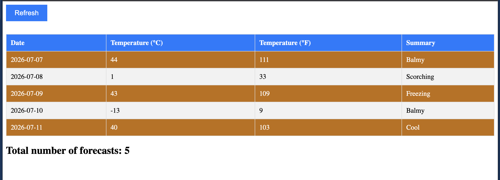

# Weather Forecast Application - Github Actions Demo


## ✨ Features

- **Real-time Weather Data**: Fetches and displays weather forecasts from an API
- **Interactive UI**: Refresh button with loading states and error handling
- **Responsive Design**: Clean, modern table layout with hover effects
- **Visual Indicators**: 
  - Hot temperature rows (>30°C) highlighted in orange
  - Loading states with user feedback
  - Error handling with clear messages
- **Signal-based State Management**: Uses Angular's modern signal API for reactive data
- **Standalone Components**: Built with Angular's standalone component architecture

## 🛠️ Technologies

- **Angular**: Latest version with standalone components
- **TypeScript**: For type-safe code
- **Signals**: Angular's reactive state management
- **CSS3**: Custom styling with responsive design


## 🚀 Installation

1. **Clone the repository**
```bash
git clone https://github.com/laxmanp090404/GithubActionsDemo
cd GithubActionsDemo
```

2. **Install dependencies**
```bash
npm install
```

3. **Set up environment variables**
Create an `environment.ts` file in `src/environment/`:
```typescript
export const baseUrl = "YOUR_API_BASE_URL";
```

## 🏃 Running the Application

### Development Server
```bash
ng serve
```
Navigate to `http://localhost:4200/`. The application will automatically reload if you change any source files.


## 🔨 Building for Production

```bash
ng build --configuration production
```
The build artifacts will be stored in the `dist/` directory.

### GitHub Pages Deployment
The project includes a GitHub Actions workflow for automatic deployment:
1. Push to the `main` branch
2. GitHub Actions automatically builds and deploys to GitHub Pages
3. Access your app at `https://[username].github.io/GithubActionsDemo/`
4. My app is deployed at [https://laxmanp090404.github.io/GithubActionsDemo/](https://laxmanp090404.github.io/GithubActionsDemo/)

## 📁 Project Structure

```
src/
├── app/
│   ├── components/
│   │   └── weatherforecast/
│   │       ├── weatherforecast.component.ts
│   │       ├── weatherforecast.html
│   │       └── weatherforecast.css
│   ├── models/
│   │   └── weatherforecast.model.ts
│   ├── services/
│   │   └── weatherforecast.api.service.ts
│   └── app.component.ts
├── environment/
│   └── environment.ts
└── styles.css
```


## 🔧 Configuration

### Environment Variables

The application uses environment files for configuration:

```typescript
// environment.ts
export const baseUrl = "https://api.example.com";
```

### GitHub Actions Setup

The included workflow automatically deploys to GitHub Pages:

1. Create `API_BASE_URL` secret in your repository
2. Enable GitHub Pages in repository settings
3. Push to `main` branch for automatic deployment



